I work where systems stop agreeing with each other.

Two platforms. Different assumptions. Different APIs. Probably different decades.
Someone still has to make them talk.

That's usually me.

I build **backends, integrations, automation, and infrastructure** — mostly the parts users never notice until they stop working.

I like software that survives more than the happy path: bad data, weird users, legacy systems, production traffic, Monday mornings.

---

## `what_i_do()`

At Sorgetech, I work on enterprise software for manufacturing, retail and public-sector clients.

**Backend engineering**
Java, Spring Boot, Jakarta EE, Tomcat. Multi-tenant applications, authentication, authorization, RBAC, APIs and business logic that inevitably becomes more complicated than the diagram suggested.

**Systems integration**
Connecting platforms that were absolutely not designed with each other in mind. REST APIs, enterprise software, custom services, data synchronization and automation.

**ITSM**
Extending and integrating SysAid: custom reporting, workflows, APIs and tooling around real operational processes.

**SQL performance**
MySQL and SQL Server, including hierarchical datasets and queries where *“it only takes a few minutes”* is considered a bug.

**Applied AI**
NLP pipelines, MCP servers and LLM-powered automation connected to software people actually use at work.

> Repetitive task? Automate it.
> Fragile system? Redesign it.
> Query takes four minutes? We're not shipping that.

---

## `git log --oneline`

Most of this profile is chronological.

Every project is basically something I had just learned, pushed slightly further than was reasonable.

Looking back, there's also a recurring pattern:
**solve a problem → learn something new → solve the same class of problem again under worse constraints.**

Apparently that's how I learn.

### 2023 — loops, arrays, stubbornness

No OOP yet. No data structures course. Just enough knowledge to become dangerous.

* [**huffman-simple**](https://github.com/anItalianGeek/huffman-simple)
  Huffman coding in **8086 assembly**: tree construction, code table generation, encoding and decoding.

  I had already implemented it in C# for an assignment. Then I rewrote it in assembly for the highly scientific reason of *“I wonder if I can.”*

* [**maze-solver**](https://github.com/anItalianGeek/maze-solver)
  Backtracking maze solver in C#, using an explicit crossroad stack instead of recursion.

---

### 2024 — objects, networks, threads

Turns out adding abstractions creates entirely new ways to make bugs.

* [**jpictureslot**](https://github.com/anItalianGeek/jpictureslot)
  Java Swing didn't have the equivalent of C#'s `PictureBox`, so I built one.

  Five display modes, automatic resizing, drop-in usage. I kept reusing it in later projects, making it probably the most accidentally useful repository on this profile.

* [**network-chef**](https://github.com/anItalianGeek/network-chef)
  Subnetting calculator built to answer two questions:

  1. How much of my networking coursework could I turn into actual software?
  2. How fast could I make it?

  Nobody asked me to build this one.

* [**mazeSolver-multiThread**](https://github.com/anItalianGeek/mazeSolver-multiThread)
  Same maze problem as the year before.

  This time: concurrent `PathFinder` threads, semaphore synchronization and a Swing visualization of the search happening in real time.

  Same problem. Harder constraint.

---

### Summer 2024 — browser acquired

I spent a month interning at **CS nine Business Solutions in Vienna**.

Before I left, they gave me a challenge:

> Build a functioning social platform.
> Three months.
> Whatever state it's in when the clock runs out.

So I did.

* [**PostItter**](https://github.com/anItalianGeek/PostItter)
  Angular frontend with timeline, search, notifications and real-time chat.

* [**PostItter API**](https://github.com/anItalianGeek/PostItter_RESTfulAPI)
  ASP.NET Core backend with token authentication and SignalR hubs.

This was the point where software stopped feeling like isolated exercises and started feeling like systems.

---

### 2024/25 — works on my machine wasn't enough anymore

A school assignment became the largest project I'd built up to that point.

Then my teachers made me deploy it properly.

Raspberry Pi.
Real domain.
TLS.
Database.
Linux services.
Automatic recovery after reboot.

Suddenly `localhost` wasn't a deployment strategy.

* [**ReviewHub API**](https://github.com/anItalianGeek/reviewhub_restAPI)
  Spring Boot backend with JWT authentication through Spring Security, role-based access and JPA persistence on MariaDB.

* [**ReviewHub**](https://github.com/anItalianGeek/reviewhub)
  Angular frontend for bookings, rooms, subjects and administration.

---

### July 2025 — Sorgetech

Then the toy problems ended.

Enterprise systems, production databases, integrations, legacy constraints, real users and real consequences.

Most of what I work on today lives in the section at the top of this page.

The repositories below are where I learned how to get here.

---

## `stack`

|                         |                                                            |
| ----------------------- | ---------------------------------------------------------- |
| **Backend**             | Java · Spring Boot · Jakarta EE · C# / .NET · Python · PHP |
| **Frontend**            | Angular · TypeScript · JavaScript · HTML · CSS             |
| **Data**                | MySQL · MariaDB · SQL Server · MongoDB                     |
| **Infra**               | Linux · Docker · Tomcat · Apache · Git                     |
| **Closer to the metal** | C · x86 assembly · Arduino / ESP32                         |

---

## `ping ognjen`

[**LinkedIn**](https://www.linkedin.com/in/ognjen-vasic-1b405a41b/) · **[ognjenvasic70@gmail.com](mailto:ognjenvasic70@gmail.com)**

Based in **Veneto, Italy 🇮🇹**

Yes, the GitHub handle is exactly as literal as it sounds.  
Alternate pronouns: C/C++.  
Today's workaround is tomorrow's critical infrastructure.
