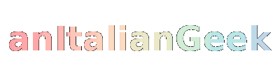

<h1 align="center">👋 Hi, I'm Ognjen Vasic</h1>
<h3 align="center">💻 High school student with a strong passion for software & web development</h3>

  <!-- Badge animato: GIF generata da SVG -->
  

---

### 📫 How to reach me

📧 **ognjenvasic70@gmail.com**

---

### 🛠️ Languages & Tools

  
  
  
  
  
  
  
  
  
  
  
  
  
  

---

### 📊 GitHub Stats

  
  

---

### ⚡ Fun Fact

- Been leaking API keys since 2006!
- Alternate pronouns are "C/C++"
